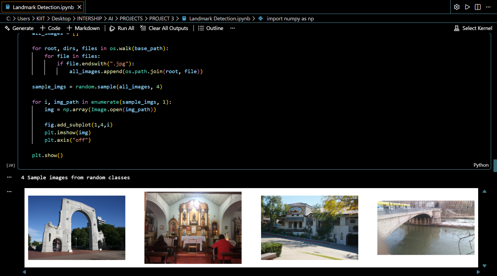

# Landmark Detection (AI Project)

## Overview
This project focuses on landmark detection using deep learning techniques. The model is developed using TensorFlow/Keras to identify and classify landmarks from image data.

## Technologies Used
- Python  
- TensorFlow  
- Keras  
- NumPy  

## Features
- Image preprocessing  
- Model training and evaluation  
- Landmark detection and classification  

## How it Works
The model is trained on labeled image data. After preprocessing, it learns patterns and predicts landmarks from input images.

## Screenshot

## Project File
- Landmark Detection.ipynb

## Notes
- Requires Python and TensorFlow environment  
- Model performance depends on dataset quality  

## Author
Procheta Ray
